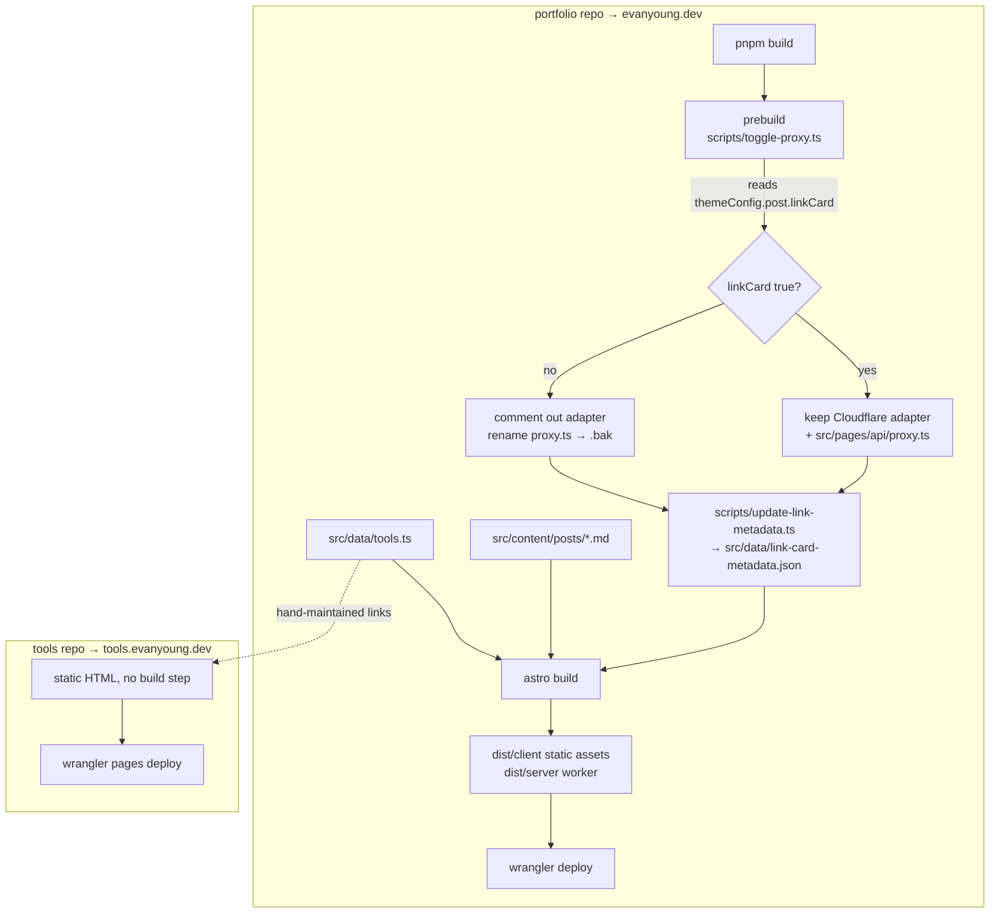

# How this site builds and deploys

Two separate sites, two separate repos, deliberately not coupled.

## The portfolio build

`pnpm build` runs three things in order:

1. **`scripts/toggle-proxy.ts`** — see the warning below.
2. **`scripts/update-link-metadata.ts`** — fetches OpenGraph data for any link
   cards in posts and caches it to `src/data/link-card-metadata.json`, so the
   build doesn't refetch on every run.
3. **`astro build`** — outputs `dist/client` (static assets) and `dist/server`
   (the Cloudflare Worker).

Deploy is `wrangler deploy -c dist/server/wrangler.json`.

### Warning: `toggle-proxy.ts` couples SSR to a content flag

Setting `themeConfig.post.linkCard = false` in `src/config.ts` does more than
turn off link cards. The prebuild script **comments out the Cloudflare adapter
in `astro.config.ts` and renames `src/pages/api/proxy.ts` to `.bak`**, which
takes down *every* SSR route, not just the link-card proxy.

It also rewrites `astro.config.ts` in place, so flipping that flag produces an
unrelated-looking diff in a file you didn't edit.

`/tools` is fully static and unaffected. But anything server-rendered added
later will silently vanish if that flag is ever turned off.

### `netlify.toml` is vestigial

It publishes `dist`, while `astro.config.ts` uses `@astrojs/cloudflare` and the
`deploy` script targets `dist/server/wrangler.json`. Cloudflare is the real
target; the Netlify config is leftover and should be deleted.

## The tools site

No build step at all — `wrangler pages deploy .` copies the files up. Each tool
is a single HTML file with inline CSS and JS.

The `/tools` page on the portfolio is a **hand-maintained** index in
`src/data/tools.ts`. It links to `tools.evanyoung.dev` but does not fetch from
it, so the portfolio build never depends on the tools site being reachable.
Adding a tool means editing both repos. That is the intended tradeoff: two
edits, versus a build that can fail because another site is down.
