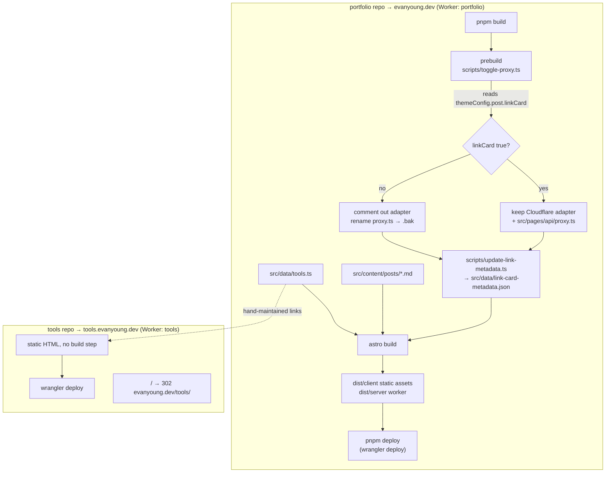

# How this site builds and deploys

Two separate sites, two separate repos, both Cloudflare Workers deployed by
Cloudflare Workers Builds on push to `main`.

## Deploys

Both Workers are connected to their GitHub repos through Workers Builds
(Cloudflare dashboard → Workers → the Worker → Settings → Build).

| Worker    | Branch        | Command                                                     | Effect                      |
| --------- | ------------- | ----------------------------------------------------------- | --------------------------- |
| portfolio | `main`        | `pnpm deploy`                                               | live on evanyoung.dev       |
| portfolio | anything else | `npx wrangler versions upload -c dist/server/wrangler.json` | preview version, not live   |
| tools     | `main`        | `npx wrangler deploy`                                       | live on tools.evanyoung.dev |

So what's live is what's on `main`. Don't run `pnpm deploy` from a local
checkout: it ships whatever that checkout has, and a later push to `main`
silently overwrites it. That is how an unpushed branch once ended up live and
then was one push away from disappearing.

GitHub Actions (`.github/workflows/ci.yml`) only validates and builds; it does
not deploy.

## The portfolio build

`pnpm build` runs three things in order:

1. **`scripts/toggle-proxy.ts`** — see the warning below.
2. **`scripts/update-link-metadata.ts`** — fetches OpenGraph data for any link
   cards in posts and caches it to `src/data/link-card-metadata.json`, so the
   build doesn't refetch on every run.
3. **`astro build`** — outputs `dist/client` (static assets) and `dist/server`
   (the Cloudflare Worker).

Deploy is `wrangler deploy -c dist/server/wrangler.json`.

### Warning: `toggle-proxy.ts` couples SSR to a content flag

Setting `themeConfig.post.linkCard = false` in `src/config.ts` does more than
turn off link cards. The prebuild script **comments out the Cloudflare adapter
in `astro.config.ts` and renames `src/pages/api/proxy.ts` to `.bak`**, which
takes down _every_ SSR route, not just the link-card proxy.

It also rewrites `astro.config.ts` in place, so flipping that flag produces an
unrelated-looking diff in a file you didn't edit.

`/tools` is fully static and unaffected. But anything server-rendered added
later will silently vanish if that flag is ever turned off.

## The tools site

No build step at all. `wrangler deploy` uploads the repo root as static assets
for the `tools` Worker. Each tool is a single HTML file with inline CSS and JS.

The `/tools` page here is **the only index** of those tools. The root of
tools.evanyoung.dev redirects to it, so there is no second list to keep in sync.
It is hand-maintained in `src/data/tools.ts`: it links to `tools.evanyoung.dev`
but does not fetch from it, so the portfolio build never depends on the tools
site being reachable. Adding a tool means a directory in the tools repo plus an
entry here — two edits, versus a build that can fail because another site is
down.
